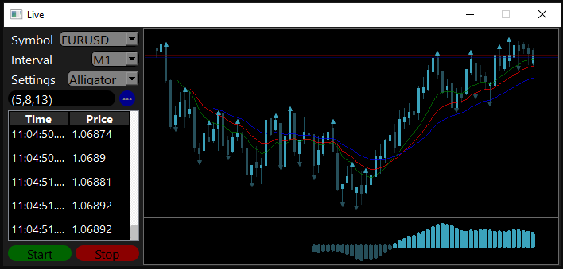

# Cpp Embedded in Python GUI Desktop App

Desktop application that integrates a graphical interface in Python with logic implemented in C++,
ideal for financial simulations or high-performance applications.

## Description
This project demonstrates how to combine the flexibility of graphical interfaces in Python with the processing efficiency of C++,
allowing complex logic to be executed efficiently from a user-friendly GUI.

## Features
- **Python Graphical Interface**: Use libraries like PyQt to create an intuitive GUI.
- **C++ Backend**: Implement business logic in C++ for optimal performance.
- **Python-C++ Integration**: Communication between Python and C++ using integration techniques like pybind11.

## Screenshot

## Technologies Used
- **Python**: For the graphical interface and control logic.
- **C++**: For the implementation of high-performance algorithms.
- **Integration Libraries**: pybind11 or similar for communication between Python and C++.

## License
This project is not licensed under an open license. All rights reserved. Personal use only.

